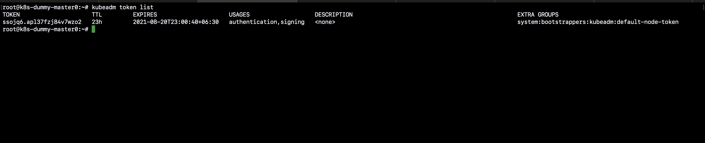

# join new worker nodes to existing k8s cluster
### Creating a New Token
1. Using the kubeadm command, list your current tokens on the Master node. If your cluster was initialized over 24-hour ago, the list will likely be empty, since a token’s lifespan is only 24-hours.
```
kubeadm token list
```

2. Create a new token using kubeadm. By using the –print-join-command argument kubeadm will output the token and SHA hash required to securely communicate with the master.

```
kubeadm token create --print-join-command
```
output will be similar like below
```
kubeadm join 192.168.92.241:6443 --token ssojq6.apl37fzj84v7wzo2 --discovery-token-ca-cert-hash sha256:7270b4d84d2110290f71ee0e8d2201c4bd594e9ffa13e0f6cf129b2286513d30
```
3. Use kubeadm to list all tokens in order to verify our new one.

```
kubeadm token list
```
output will be similar like below



### Joining the New Worker to the Cluster
1. Using SSH, log onto the new worker node.

2. Use the kubeadm join command with our new token to join the node to our cluster.

```
kubeadm join 192.168.92.241:6443 --token ssojq6.apl37fzj84v7wzo2 --discovery-token-ca-cert-hash sha256:7270b4d84d2110290f71ee0e8d2201c4bd594e9ffa13e0f6cf129b2286513d30
```
3. login to master node and check the worker node is successfully joned or not.
```
kubectl get nodes -owide
```

### delete the token 

1. List the token first.
```
kubeadm token list
```
output will be similar like below


2. Delete the token that you wish

```
kubeadm token delete lk3v5v.wdzpx0yonqseocoz
```

[click here for link](https://www.serverlab.ca/tutorials/containers/kubernetes/how-to-add-workers-to-kubernetes-clusters/)

@yannainglin
